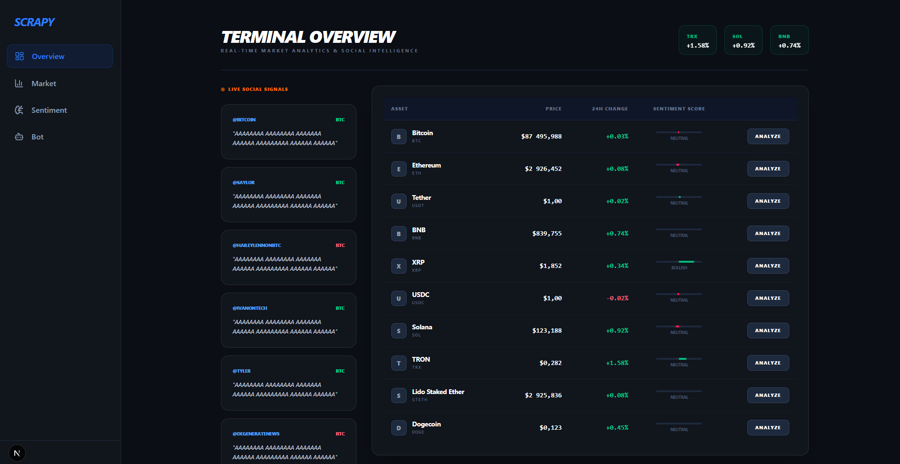
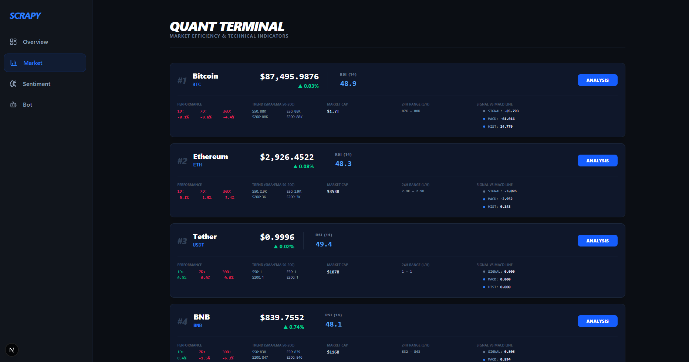
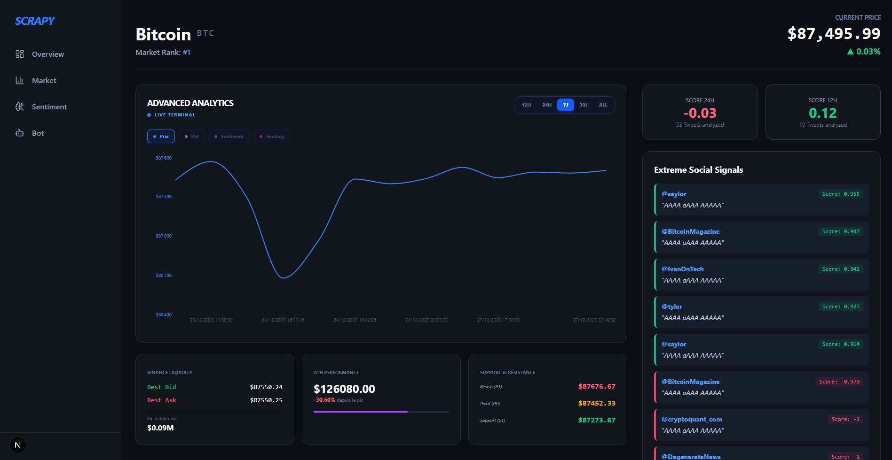
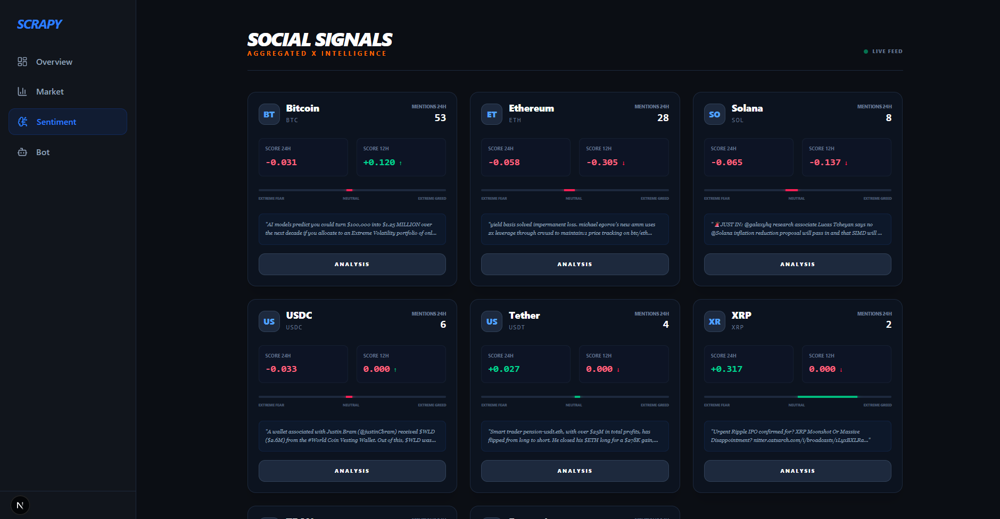
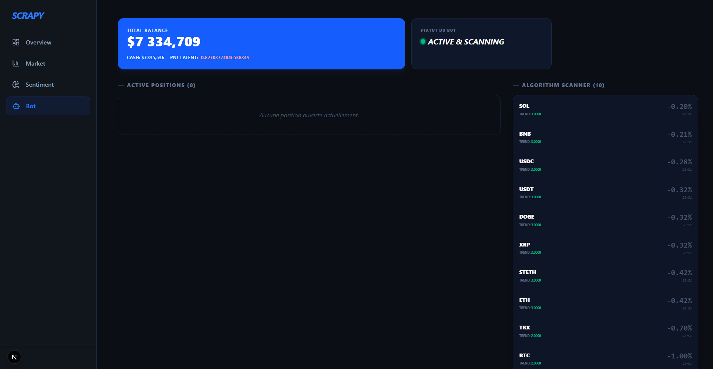

# Cryptocurrency Trading Bot & Analytics Dashboard

A comprehensive full-stack cryptocurrency trading and analysis platform combining automated trading strategies, real-time market data collection, Twitter sentiment analysis, and an interactive Next.js dashboard. This system integrates technical analysis, social sentiment scoring, and algorithmic trading with portfolio tracking. Please note: The trading bot is not yet effective. 

## Project Overview

This project provides an automated cryptocurrency analysis and trading system with real-time data visualization. It continuously collects market data from CoinGecko and Binance, analyzes social sentiment from Twitter, executes trading strategies based on multi-layered decision logic, and displays everything through a modern Next.js dashboard with interactive charts and real-time updates.

### What This Project Does

1. **Automated Market Data Collection**: Fetches cryptocurrency prices, technical indicators, and market metrics
2. **Multi-Source Integration**: Combines CoinGecko API, Binance futures data, and Twitter sentiment
3. **Advanced Technical Analysis**: Calculates RSI, MACD, EMA/SMA, Fibonacci retracements, pivot points, and volume analysis
4. **Twitter Sentiment Analysis**: Scrapes tweets from 100+ crypto influencers and analyzes sentiment using AI models
5. **Automated Trading Bot**: Executes trades based on technical signals, sentiment confirmation, and risk management
6. **Portfolio Tracking**: Real-time portfolio performance monitoring with PnL tracking
7. **Next.js Dashboard**: Modern, responsive web interface with server-side rendering
8. **Interactive Charts**: Visualize historical data with customizable technical indicators
9. **Real-time Updates**: Live market data and sentiment updates every 10-30 seconds

## Architecture

```
┌─────────────────────────────────────────────────────────────────┐
│                        USER INTERFACE                           │
│              Next.js App (Port 3000) + API Routes               │
│     [Overview, Market, Crypto Details, Bot Dashboard]           │
└────────────────────────────┬────────────────────────────────────┘
                             │ API Routes (/api/*)
                             ↓
┌─────────────────────────────────────────────────────────────────┐
│                    NEXT.JS API ROUTES                           │
│    /api/market, /api/crypto/[id], /api/history/[id],            │
│              /api/crypto/[id]/tweets , ...                      │
│                  (Direct PostgreSQL queries)                    │
└────────────────────────────┬────────────────────────────────────┘
                             │ SQL Queries (pg)
                             ↓
┌────────────────────────────────────────────────────────────────┐
│                      POSTGRESQL DATABASE                       │
│  [cryptos, crypto_ranks, cyptos_data_base, cyptos_data_details,│
│   cyptos_data_binance, crypto_sentiment_scores, tweet_hash,    │
│   tweet_sentiments, tweet_crypto, crypto_scores,               │
│   crypto_trade_data, portfolio_performance]                    │
└──────────┬──────────────────┬──────────────────┬───────────────┘
           │                  │                  │
           ↑ Insert           ↑ Insert           ↑ Insert/Update
           │                  │                  │
┌──────────┴────────┐ ┌───────┴──────────┐ ┌─────┴─────────────┐
│   Market Service  │ │ Sentiment Service│ │   Trading Bot     │
│   (Python)        │ │    (Python)      │ │   (Python)        │
│                   │ │                  │ │                   │
│ CoinGecko API     │ │ Twitter Scraper  │ │ Signal Layer      │
│ Binance API       │ │ NLP Sentiment    │ │ Decision Layer    │
│ Technical Analysis│ │ Fuzzy Matching   │ │ Risk Layer        │
│ Every 60min       │ │ Every 30min      │ │ Execution Layer   │
└───────────────────┘ └──────────────────┘ └───────────────────┘
```

## 📁 Project Structure

```
ScrapyTMP/
│
├── frontend/
│   └── scrapy-front-next/          # Next.js 16 Application
│       ├── src/
│       │   ├── app/
│       │   │   ├── page.js         # Overview page (market + hot tweets)
│       │   │   ├── market/page.js  # Market explorer (all cryptos)
│       │   │   ├── crypto/[id]/page.js  # Crypto detail page
│       │   │   ├── bot/page.js     # Trading bot dashboard
│       │   │   ├── api/
│       │   │   │   ├── market/route.js     # Market data API
│       │   │   │   ├── crypto/[id]/route.js
│       │   │   │   ├── history/[id]/route.js
│       │   │   │   └── crypto/[id]/tweets/route.js
│       │   │   └── layout.js       # Root layout with sidebar
│       │   ├── components/
│       │   │   ├── layout/Sidebar.jsx
│       │   │   ├── ui/HotTweets.jsx
│       │   │   ├── ui/SentimentSection.jsx
│       │   │   └── charts/MultiChart.jsx
│       │   ├── hooks/
│       │   │   └── useMarketData.js
│       │   └── lib/
│       │       └── db.js           # PostgreSQL connection
│       ├── package.json
│       ├── tailwind.config.js
│       └── next.config.js
│
├── scrapy/                         # Python core modules
│   ├── __init__.py
│   ├── config/
│   │   └── settings.py             # Centralized configuration
│   ├── data/
│   │   └── database.py             # CryptoDatabase OOP class
│   ├── utils/
│   │   └── logger.py               # Logging utilities
│   ├── core/
│   │   └── enums.py                # Enums (MarketRegime, LongShort)
│   ├── services/
│   │   ├── coingecko_service.py
│   │   ├── binance_service.py
│   │   └── technical_analysis_service.py
│   └── trading/                    # Trading bot modules
│       ├── SignalLayer/            # Technical signals
│       │   ├── Technical_signal_scoring.py
│       │   ├── Market_detection_detection.py
│       │   ├── SentimentConfirmation.py
│       │   └── Risk_filter.py
│       ├── DecisionLayer/          # Entry/Exit logic
│       │   ├── Entry_logic.py
│       │   ├── Stop_tp_logic.py
│       │   └── Trade_frequency_control.py
│       ├── RiskLayer/              # Risk management
│       │   ├── Correlation_exposure.py
│       │   ├── Daily_loss_limit.py
│       │   └── Max_drawdown_controle.py
│       └── ExecutionLayer/         # Order execution
│           └── Fees_model.py
│
├── scripts/                        # Python service scripts
│   ├── crypto_market_service.py    # Market data collector (runs every 60min)
│   ├── crypto_sentiment_service.py # Sentiment analyzer (runs every 30min)
│   ├── crypto_trading_bot.py       # Trading bot (runs every 15min)
│   └── database_cleanup_utility.py # Database maintenance
│
├── html_output/                    # Scraped Twitter HTML (gitignored)
└── README.MD                       # This file
```

## Complete Installation Guide

### Prerequisites

- **Python + dependence**: 3.10+
- **Node.js**: 18+
- **PostgreSQL**: 15+
- **Chrome/Chromium**: For Selenium web scraping
- **Git**: For cloning the repository

### Step 1: Clone Repository

```bash
git clone <repository-url>
cd ScrapyTMP
```

### Step 2: PostgreSQL Setup

#### Install PostgreSQL

**Windows**:
- Download from [postgresql.org](https://www.postgresql.org/download/windows/)
- Install with default settings
- Remember the postgres password

**Ubuntu/Debian**:
```bash
sudo apt update
sudo apt install postgresql postgresql-contrib
sudo systemctl start postgresql
```

**macOS**:
```bash
brew install postgresql@15
brew services start postgresql@15
```

#### Create Database and User

```bash
# Connect to PostgreSQL
psql -U postgres

# Create database and user
CREATE DATABASE crypto;
CREATE USER crypto WITH PASSWORD 'crypto';
GRANT ALL PRIVILEGES ON DATABASE crypto TO crypto;
\q
```

#### Configure Connection

Edit `scrapy/config/settings.py`:

```python
DB_CONFIG = {
    "host": "localhost",
    "port": 5432,
    "database": "crypto",
    "user": "crypto",
    "password": "crypto",
}
```

### Step 3: Python Backend Setup

#### Install Python Dependencies

```bash
# Install the scrapy package as a local editable library
pip install -e .

# This installs all required dependencies
```

#### Initialize Database Tables

```bash
python scripts/database_cleanup_utility.py
```

This creates all required tables. Check `scrapy/config/settings.py` for options:
- `CREATE_ALL_TABLES_IF_MISSING = True`
- `DROP_MARKET_DATA_TABLES = False`
- `DROP_SENTIMENT_DATA_TABLES = False`

### Step 4: Frontend Setup (Next.js)

```bash
cd frontend/scrapy-front-next

# Install dependencies
npm install

# Configure database connection in src/lib/db.js (should match Python config)
```

### Step 5: Configuration

Edit `scrapy/config/settings.py`

## 🎯 Running the System

You need **four separate terminals**:

### Terminal 1: Market Data Collector

```bash
# Activate venv first
python scripts/crypto_market_service.py
```

Runs every **60 minutes**, collecting:
- Price, volume, market cap from CoinGecko
- Technical indicators (RSI, MACD, EMA, SMA, Fibonacci, Pivots)
- Binance futures data (funding rate, open interest)

### Terminal 2: Sentiment Analyzer

```bash
python scripts/crypto_sentiment_service.py
```

Runs every **30 minutes**, performing:
- Twitter scraping from 100+ influencers
- AI sentiment analysis using transformer models
- Crypto mention detection with fuzzy matching
- 12h and 24h sentiment score aggregation

### Terminal 3: Trading Bot (Optional)

```bash
python scripts/crypto_trading_bot.py
```

Runs every **15 minutes**, executing:
- Market regime detection (Trend/Range/Panic)
- Technical signal scoring (weighted indicators)
- Sentiment confirmation layer
- Position sizing with risk management
- Stop-loss and take-profit management
- Portfolio performance tracking

### Terminal 4: Next.js Dashboard

```bash
cd frontend/scrapy-front-next
npm run dev
```

Access at: `http://localhost:3000`

For mobile access on same network:
```bash
npm run dev -- -H 0.0.0.0
# Then access via: http://YOUR_LOCAL_IP:3000
```

## Dashboard

### Overview Page (`/`)



- **Market Table**: Real-time prices, 24h changes, sentiment scores
- **Top Gainers**: Top performing cryptos
- **Hot Tweets**: Latest tweets with extreme sentiment (|score| ≥ 0.7)
- **Sentiment Bars**: Visual sentiment strength indicators

### Market Explorer (`/market`)



- **Comprehensive Cards**: All cryptos with full metrics
- **Technical Indicators**: RSI, MACD, SMA/EMA displayed inline
- **Performance Metrics**: 1D, 7D, 30D percentage changes
- **Real-time Updates**: Auto-refresh every 10 seconds

### Crypto Detail Page (`/crypto/[id]`)



- **Multi-chart View**: Price history with customizable overlays
- **Technical Analysis**: indicators in detail
- **Recent Tweets**: tweets mentioning the crypto

### Sentiment Page (`/sentiment`)



- **Sentiment Overview**: Aggregated sentiment scores across all tracked cryptocurrencies

### Bot Dashboard (`/bot`)



- **Portfolio Overview**: Total balance, free cash, unrealized PnL
- **Open Positions**: Current trades with entry/exit prices

## Trading Bot Architecture

### Layer 1: Signal Layer
- **Technical Signal Scoring**: Weighted scoring of RSI, MACD, EMA, SMA, volatility, pivots, Fibonacci
- **Market Detection**: Identifies Trend, Range, or Panic market regimes
- **Sentiment Confirmation**: Validates signals with Twitter sentiment
- **Risk Filter**: Pre-trade checks (daily loss, drawdown, correlation)

### Layer 2: Decision Layer
- **Entry Logic**: Combines technical + sentiment scores for long/short decisions
- **Position Sizing**: Dynamic sizing based on signal confidence and risk
- **Stop/TP Logic**: Multi-level take-profits (TP1: 50%, TP2: 30%, Runner: 20%)
- **Trade Frequency Control**: Prevents over-trading (min 60min between trades)

### Layer 3: Risk Layer
- **Daily Loss Limit**: Max 2% daily loss
- **Max Drawdown Control**: Max 20% drawdown from peak
- **Correlation Exposure**: Limits correlated positions

### Layer 4: Execution Layer
- **Fees Model**: Accounts for trading fees (0.5%)
- **Order Management**: Tracks entry, TP1, TP2, stop-loss, runner

## 📝 Logging

Logs are stored in `logs/` directory.

## 📚 Resources

- **Next.js Documentation**: https://nextjs.org/docs
- **CoinGecko API**: https://www.coingecko.com/api/documentation
- **Binance API**: https://binance-docs.github.io/apidocs/
- **Hugging Face Transformers**: https://huggingface.co/docs/transformers
- **TA-Lib**: https://mrjbq7.github.io/ta-lib/

## ⚠️ Disclaimer

This project is for **educational purposes only**. 

- **Not financial advice**: Do not use this bot for real trading without thorough testing
- **Use at your own risk**: Cryptocurrency trading carries significant risk
- **No warranties**: The authors assume no liability for financial losses
- **Test first**: Always test with paper trading before using real capital

## 📄 License

Apache License 2.0 - Educational use only

